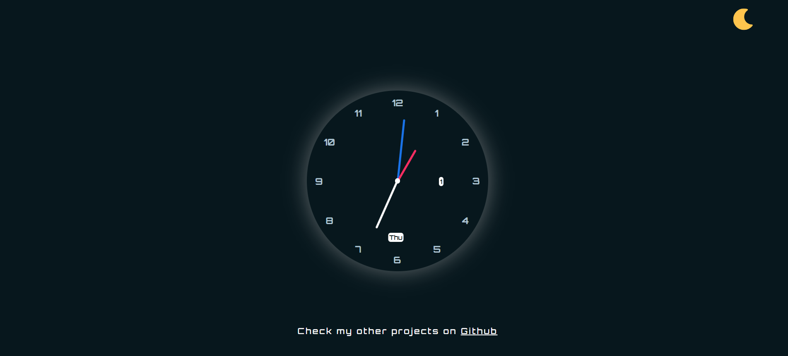
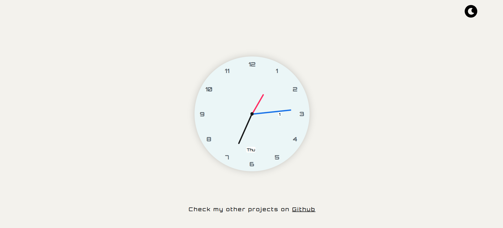

# 🕒 Analog Clock | JavaScript Project

Welcome to the **Analog Clock** project — a clean, elegant, and interactive clock built with **HTML**, **CSS**, and **JavaScript**. Inspired by minimal UI aesthetics, this clock not only displays the current time but also offers **dark/light mode toggling**, **dynamic date & day display**, and a **pop-up contact panel** with social links.

---

## 🚀 Features

✨ **Live Analog Clock**  
🌓 **Dark / Light Mode Toggle**  
📅 **Real-Time Day & Date Display**  
💬 **Social Media Pop-Up**  
📱 **Responsive Design**  
🎨 **Orbitron Font for Futuristic Feel**  

---

## 💻 Demo

🔗 [View Live Demo](https://codexaarogya.github.io/Analog_Clock/) 

---

## 📸 Preview

| Dark Mode | Light Mode |
|----------|------------|
|  |  |

---

## 🛠️ Built With

- **HTML5**
- **CSS3** (Custom Properties + Flexbox)
- **JavaScript (Vanilla)**
- **Google Fonts - Orbitron**

---

## 📸 Screens & Functionality

🕶️ **Dark Mode: Calming deep tones with neon-style hand indicators**  
🌤️ **Light Mode: Fresh, clean look for better visibility during the day**  
⌚ **Animated Hands: Hour, Minute & Second hands rotate smoothly in real time**  
📆 **Day & Date Display: Helpful daily info displayed inside the clock face**  
💡 **Pop-up Modal: Social links neatly displayed in a toggleable pop-up**  
